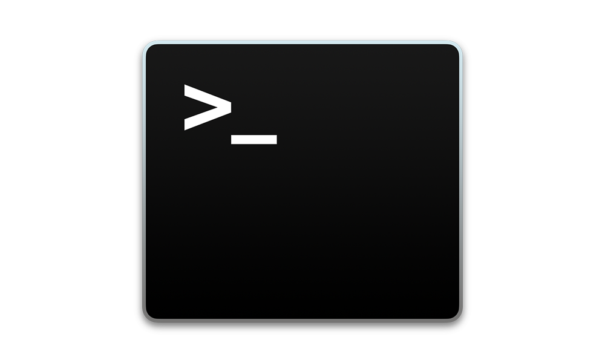

In this file, I will discuss the steps involved in setting up the necessary environment and creating new folders and files for a lesson in this course. The process begins by opening the terminal or command prompt and navigating to the desired directory using the **cd** command. Next, I will demonstrate how to create new folders using the **mkdir** command, allowing for better organization of lesson materials.

For more information, visit [this website](https://www.howtogeek.com/how-to-create-folders-and-files-from-windows-command-prompt/#:~:text=To%20create%20a%20folder%20with,ext%2C%20replacing%20%22.)



# Folder Structure

The current folder structure is shown below.

> ga
>
> > unit1
> >
> > > lessons

# Navigate to the lessons folder

1. Open _git bash_ terminal
2. Use the **_cd_** command

**_Example:_**

```javascript
cd ga/unit1/lessons
```

# Create a new folder for the lessons

Use the **mkdir** command

**_Example:_**

```javascript
mkdir lesson1
cd lesson1
```

# Create new files

Use the **touch** command

**_Example:_**

```javascript
touch index.html app.js
```
